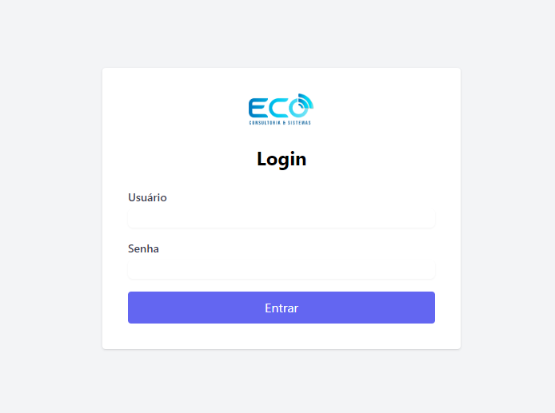
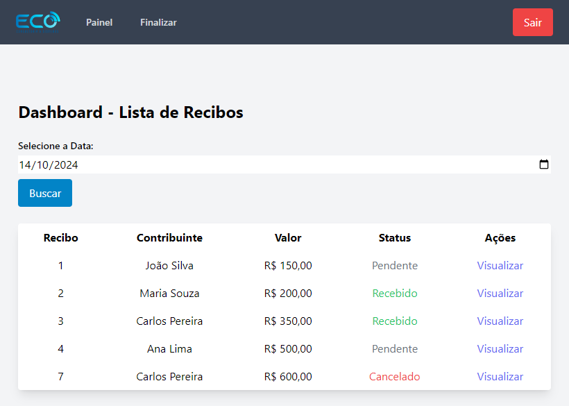
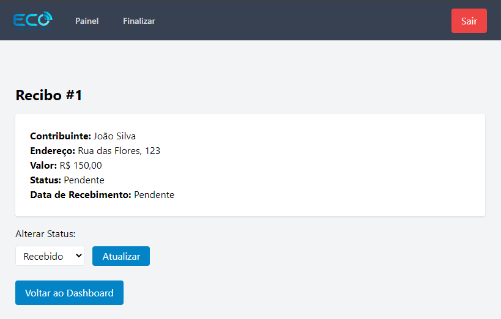
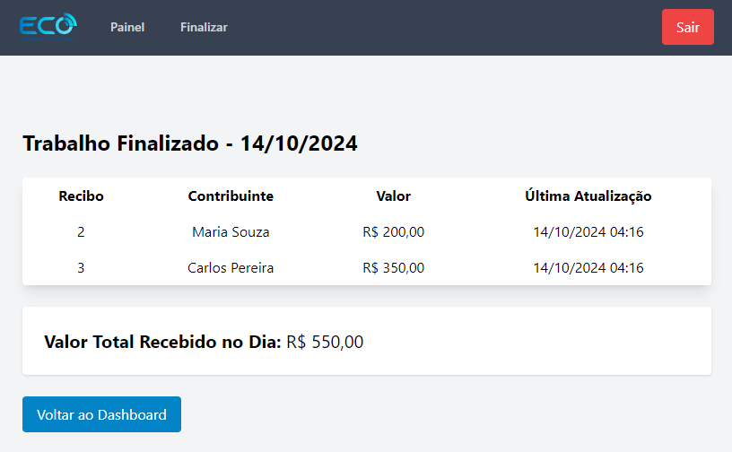

# 📦 Sistema de Recolhimento de Doações por Mensageiros 🚲  

  
  
  

## Descrição

Este projeto consiste em um sistema web desenvolvido para ser utilizado por **mensageiros (motoboys)** com o objetivo de **coletar doações** nas residências de contribuintes. A aplicação foi construída utilizando o **framework Laravel** junto com **TailwindCSS** para o front-end e **Blade** para renderização das views.

O sistema possui funcionalidades que permitem:  
- Login do mensageiro para acesso à plataforma  
- Visualização de recibos para uma data específica  
- Alteração do status do recibo entre **pendente**, **recebido** ou **cancelado**  
- Impressão de comprovante após recebimento  
- Finalização de trabalho com extrato diário das coletas realizadas  

---

## 📸 Telas do Sistema

### **Tela 1 - Login**
  
O usuário insere suas credenciais (usuário e senha) para acessar o sistema. Caso as credenciais estejam corretas, ele é redirecionado para o painel principal.

### **Tela 2 - Painel Principal**  
  
A tela principal contém uma **tabela** listando todos os recibos do dia. As colunas incluem:
- **Número do Recibo**: ID do recibo  
- **Contribuinte**: Nome do doador  
- **Valor**: Quantia doada  
- **Status**: Pendente, Recebido ou Cancelado  
- **Ações**: Permite **Visualizar** o recibo para tomar alguma ação  

### **Tela 3 - Visualização do Recibo**  
  
Ao clicar em “Visualizar” na tabela principal, abre-se uma nova página com detalhes do recibo. Nesta tela, o mensageiro pode alterar o status para **Recebido**, **Cancelado** ou **Pendente** e clicar em **Atualizar** para salvar as alterações.  

### **Tela 4 - Finalização de Trabalho**  
  
Aqui o mensageiro visualiza um **resumo diário** com o total de recibos coletados, cancelados e pendentes. O sistema exibe a quantidade de recibos e o **valor total arrecadado**.

---

## 🎯 Funcionalidades

- **Login Seguro:** Apenas usuários registrados podem acessar a aplicação.  
- **Controle de Status dos Recibos:** Altere entre **pendente, recebido ou cancelado** e registre a data de recebimento.  
- **Impressão de Comprovantes:** Geração automática de recibos para cada coleta confirmada.  
- **Relatório Diário:** Visualização e resumo das coletas realizadas no dia, separado por status.  

---

## 🛠️ Tecnologias Utilizadas

- **Laravel 9.x** - Framework PHP para desenvolvimento web  
- **PHP 8.x** - Linguagem backend  
- **TailwindCSS 3.x** - Framework CSS para estilização  
- **Blade** - Template engine do Laravel para renderização de views  
- **MySQL** - Banco de dados para persistência das informações  

---

## 📂 Estrutura do Banco de Dados

- **movimento_diario**: Registra as coletas diárias com resumo por status.  
- **contribuicao**: Armazena os dados dos recibos, incluindo valor e status.  
- **contribuinte**: Guarda as informações dos doadores (nome e endereço).  
- **mensageiro**: Informações de login e controle dos motoboys.  
- **tipos_pagamento**: Possíveis formas de pagamento para as doações.  

---

## 🔑 **Acesso ao Sistema**

Após executar as **migrations e os seeders** (comando `php artisan migrate:fresh --seed`), você pode acessar o sistema utilizando uma das credenciais iniciais geradas pelo **MensageiroSeeder**.

### **Credenciais de Acesso (Seed)**

| Usuário     | Nome             | Senha        |
|-------------|------------------|--------------|
| `johndoe`   | John Doe         | `senha123`   |
| `vinicius`  | Vinicius Aquino  | `minhasenha` |

---

### **Como Logar?**

1. **Inicie o servidor Laravel** com o seguinte comando:
   ```bash
   php artisan serve
   ```
2. Acesse o sistema no navegador em:  
   **[http://localhost:8000](http://localhost:8000)**  
3. Utilize uma das credenciais da tabela acima para **fazer login**.

---

### **Exemplo de Login**
- **Usuário:** `vinicius`  
- **Senha:** `minhasenha`  

---

Se precisar alterar ou adicionar mais usuários, edite o arquivo `MensageiroSeeder` em:

```
/database/seeders/MensageiroSeeder.php
```

Após fazer mudanças, rode novamente o comando para recriar a base com as alterações:

```bash
php artisan migrate:fresh --seed
```

---

## 🚀 Como Executar o Projeto

### Pré-requisitos

- **PHP** 8.x ou superior  
- **Composer** instalado  
- **MySQL** ou outro banco de dados relacional  
- **Node.js** e **npm** para gerenciamento dos pacotes front-end

### Passo a Passo

1. **Clone o repositório**  
   ```bash
   git clone https://github.com/vinnyaquino/recolhimento-doacoes.git
   cd seu-projeto
   ```

2. **Instale as dependências do PHP com Composer**  
   ```bash
   composer install
   ```

3. **Configure o arquivo .env**  
   Copie o arquivo `.env.example` para `.env` e configure as credenciais do banco de dados:  
   ```bash
   cp .env.example .env
   ```
   Edite o `.env`:
   ```
   DB_DATABASE=sistema_doacoes
   DB_USERNAME=usuario
   DB_PASSWORD=senha
   ```

4. **Gere a chave da aplicação**  
   ```bash
   php artisan key:generate
   ```

5. **Execute as migrações e seeds**  
   Crie as tabelas no banco de dados e preencha com dados iniciais:  
   ```bash
   php artisan migrate:fresh --seed
   ```

6. **Inicie o servidor local**  
   ```bash
   php artisan serve
   ```

7. **Acesse o sistema no navegador**  
   Abra no navegador: [http://localhost:8000](http://localhost:8000)  

---


## 📧 Contato

- **Autor:** Vinny Aquino  
- **GitHub:** [github.com/vinnyaquino](https://github.com/vinnyaquino)  
- **E-mail:** viniciusaquino123@gmail.com
- **Linkedin** [linkedin.com/in/vinnyaquino](https://linkedin.com/in/vinnyaquino)

---

## 📝 Notas Finais

Este sistema foi desenvolvido com foco na simplicidade e eficiência para mensageiros que precisam organizar as coletas de forma rápida e precisa. Com uma interface clara e funcional, o projeto oferece uma solução prática para controle de doações.
